# Quinta Etapa do Desafio Filmes e Séries

## Consumo dos Dados - Visualização e Insights

Na **Quinta Etapa** e última etapa do Desafio Filmes e Séries, nosso objetivo é **extrair insights dos dados refinados** e **apresentá-los de forma visual e interativa** usando a ferramenta de visualização **AWS QuickSight**. Até este ponto, todas as atividades envolveram ingestão, armazenamento e processamento de dados no data lake. Agora, avançamos para a camada final: **consumir e analisar os dados para gerar insights** valiosos.

## Objetivos

1. **Criação de uma Análise no AWS QuickSight:**
   - Utilizar as tabelas da **Camada Refined** como **única fonte de dados** para o QuickSight.
   - Conectar ao **AWS Athena** como fonte de dados para o QuickSight, facilitando o acesso às tabelas na Camada Refined.

2. **Exploração de Visualizações e criação do Dashboard:**
   - Explorar os diferentes tipos de visualizações oferecidos pelo QuickSight, como gráficos de linha, gráficos de barras, tabelas dinâmicas, heatmaps, entre outros.
   - Estruturar uma **narrativa** clara e objetiva a partir dos dados, com foco em fornecer insights relevantes e facilmente compreensíveis.
   - Publicar o Dashboard.

## Execução

###  1. **Criação de um Dashboard no AWS QuickSight:**
   - Acesse o **Console** da **AWS**.
   - Na barra de pesquisa, digite **"QuickSight"** e abra-o. <br>
   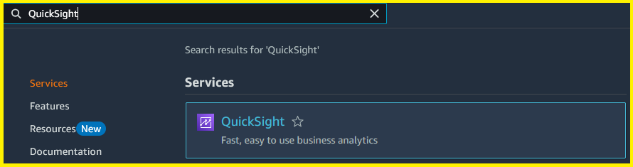
   - Caso não possua, crie uma conta no QuickSight.
   - Na página inicial do **QuickSight**, clique em **"Datasets"** na aba lateral esquerda. <br>
   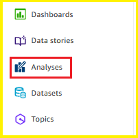
   - No canto superior direito, clique em **"New dataset"**. <br>
   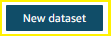
   - Em **"FROM NEW DATA SOURCES"**, selecione o **"Athena"**. <br>
   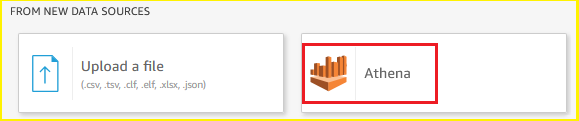
   - Em **"Data source name"**, escolha um nome para o Data Source.
   - Em **"Athena workgroup"**, escolha o seu Workgroup. <br>
   - Clique em **"Create data source** <br>
   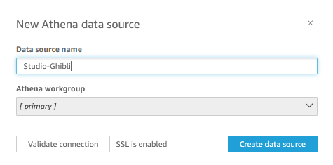
   - Clique em **"Use custom SQL"**.
   - Insira a seguinte query:
   ```SQL
   SELECT 
    movie.id AS movie_id,
    movie.id_imdb,
    movie.title,
    movie.title_original,
    movie.tagline,
    movie.overview,
    movie.runtime AS movie_runtime,
    movie.poster,
    movie.backdrop_1,
    movie.backdrop_2,
    movie.backdrop_3,
    facts.rating_imdb,
    facts.rating_tmdb,
    facts.release,
    facts.budget,
    facts.gross_worldwide,
    facts.revenue,
    facts.runtime AS fact_runtime,
    review.content AS review_content,
    review.sentiment_label AS review_sentiment
FROM 
    datalake_pb_lucas.d_movie movie
JOIN 
    datalake_pb_lucas.f_movies facts ON movie.id = facts.id
LEFT JOIN 
    datalake_pb_lucas.review review ON movie.id_imdb = review.id_imdb;
   ```
   - Clique em **"Confirm Query"**. <br>
   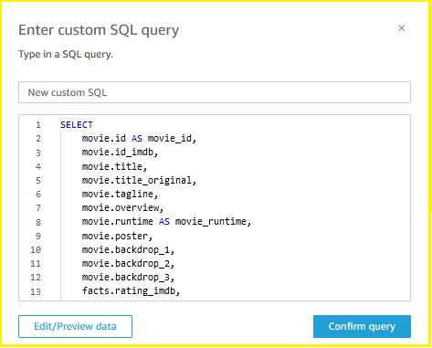
   - Clique em **"Edit/Preview Data"**. <br>
   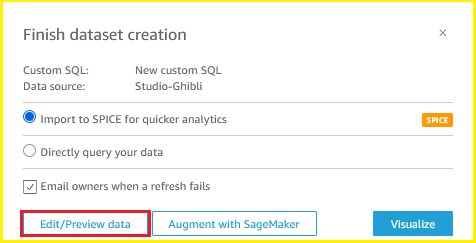
   - No canto esquerdo, em **"Fields"**, clique nos **"3 pontinhos"** nos campos que deseja remover ou alterar o nome. 
   - Antes: <br>
   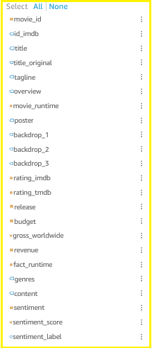
   - Depois: <br> 
   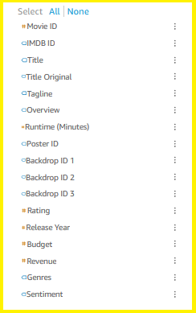
   - No canto superior direito, clique em **"SAVE & PUBLISH"**. <br> 
   
   
   - Volte para a página inicial do **QuickSight**, acesse a página **Analyses** no canto esquerdo e clique na sua análise.
   - Criamos a análise!

   ### 2. **Exploração de Visualizações e criação do Dashboard:**
   - Primeiramente, vamos criar um Layout para utilizar como base visual na Análise, utilizei o Figma. 
   - Página 1, **"Analysis"**: <br>
   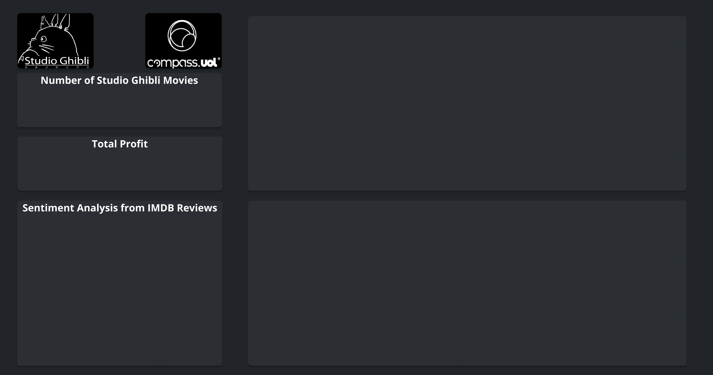
   - Página 2, **"Movie Details"**: <br>
   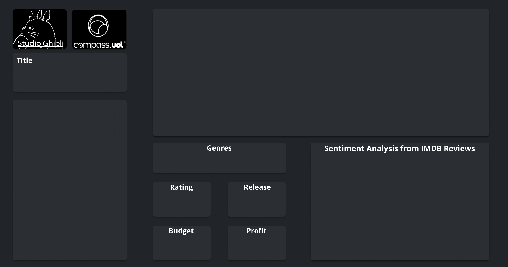
   
   - Visual: **Background Image - Analysis (Custom Visual Content)**. <br>
     - Em **Visuals**, clique no botão ao lado de **"ADD"**. <br>
     
     - Selecione o **Custom visual content**. <br>
     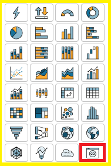
     - Clique em **Customize visual**. <br>
     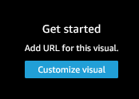
     - Em Display Settings, remova Background, Border e Selection. <br>
     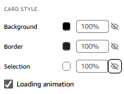
     - Em **Custom Content**, cole a URL da imagem de background da página Analysis. 
     - Clique em **Show as image**.
     - Selecione **Scale to visual**.
     - Altere a altura e largura para a máxima permitida. <br>
     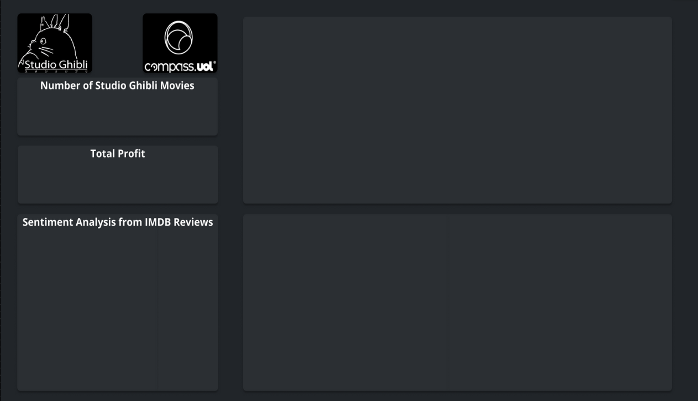
      
     - Visual: **Number of Studio Ghibli Movies (KPI)**. <br>
       - Em **Visuals**, clique no botão ao lado de **"ADD"**. <br>
       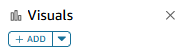
       - Selecione o **Key Performance Indicator**. <br>
       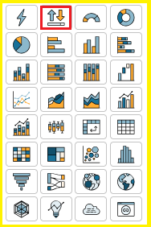
       - No canto esquerdo, altere o campo "Title" para medida e adicione-o ao Visual. <br> 
       - No visual, clique nos 3 pontos ao lado do Title, e selecione **Agregate: Count Distinct**. <br>
       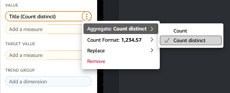
       - No canto direito, em **Properties**, clique em **Display Settings** e esconda o **Title**, **Subtitle**, **Background**, **Border** e **Selection**.
       - Arraste o card para local correto e dimensione-o para ajustar o tamanho do texto (Você pode utilizar as setas do teclado para uma maior precisão. <br>
       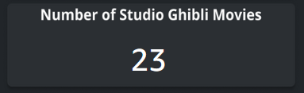

          
   - Visual: **Total Profit (KPI)**.
     - Repita os passos do **Visual: Number of Studio Ghibli Movies (KPI)**, alterando o seguinte:
     - Utilize o campo **Profit**, e a agregação **Sum**. <br> 
     
     
   

   
   - Visual: **Sentiment Analysis from IMDB Reviews (Donut Chart)**.
     - Em **Visuals**, clique no botão ao lado de **"ADD"**. <br>
      
     
     - Selecione o **Donut chart**. <br>
     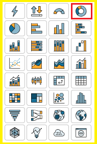
     
     - Utilize o campo dimensão **Sentiment**.
     - Em **Format visual**, expanda **Data labels**.
       - Clique em mostrar **Metric**.
       - Em **Metic label style**, selecione **Percent only**.
       - Em **Text**, selecione **Extra large**.
     - Em **Format visual**, desmarque **Legend**.
     - Assim como nos passos anteriores, remova títulos, subtítulos, background, borda e seleção.
     - Redimensione e coloque-o no local correto. <br>
     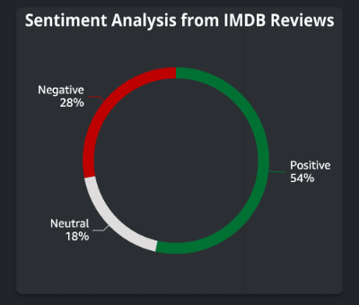
     

     
   - Visual: **Movie Profit by Year (Line Chart)**.
     - Em **Visuals**, clique no botão ao lado de **"ADD"**. <br>
     
     
     - Selecione o **Line Chart**. <br>
     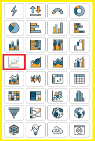
     
     - Em **X AXIS**, selecione o campo dimensão **Release**.
     - Em **VALUE**, selecione o campo medida **Profit** com agregação **Sum**.
     - Em **COLOR**, selecione o campo dimensão **Title**.
     - Assim como nos passos anteriores, remova títulos, subtítulos, background, borda e seleção. <br>
     - Altere o título de **Y-axis** para **Profit**.
     - Altere o título de **Y-axis** para **Year**.
     - Ordene por **Release** em ordem crescente.
     - Redimensione e coloque-o no local correto.
     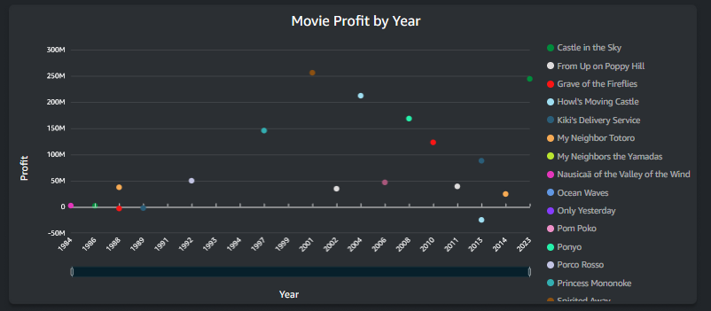
     
     

   - Visual: **Movies Table (Table)**.
     - Em **Visuals**, clique no botão ao lado de **"ADD"**. <br>
     
     
     - Selecione o **Table**. <br>
     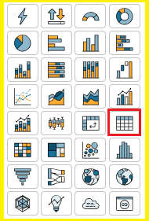
    
     - Em **GROUP BY**, adicione a dimensão **Title**.
     - Em **GROUP BY**, adicione a dimensão **Genres**.
     - Em **VALUE**, adicione a medida **Release Year** com agregação **Min**.
     - Em **VALUE**, adicione a medida *Rating** com agregação **Min**.
     - Em **VALUE**, adicione a medida **Runtime (Minutes)** com agregação **Min**.
     - Em **VALUE**, adicione a medida **Profit** com agregação **Sum**.
     - Assim como nos passos anteriores, remova títulos, subtítulos, background, borda e seleção. Tanto da tabela quanto das células. <br>
     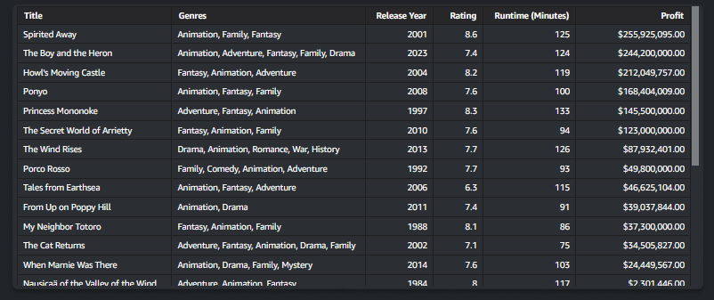
     
   

### Crie uma nova página chamada **Movie Details**
   - No topo, ao lado da página **Analysis**, clique no símbolo de **" + "**.
   - Crie uma **Interactive sheet** com **layout** **Free-form**.
   - Clique no nome da página criada para alterá-la, digite **"Movie Details"**. <br>
   

   
   
   - No canto superior em **Data**, clique em **Add Parameter**. <br>
   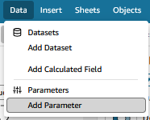

   
   
   - Em **Name**, digite **pTitle**.
   - Clique em **Create**.
   - No canto superior, clique no ícone dos parâmetros a seguir. <br>
   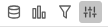

   
   - No parâmetro pTitle, clique nos 3 pontinhos e selecione **Add control**.
   - Em **Name**, digite **Title Control**.
   - Em **Style**, selecione **List**.
   - Em **Values**, selecione **Link to a dataset field**.
   - Em **Dataset**, selecione **Studio Ghibli Movies**.
   - Em **Field**, selecione **Title**.
   - Marque a opção **Hide Select all option...**.
   - Clique em **Add**. <br>
   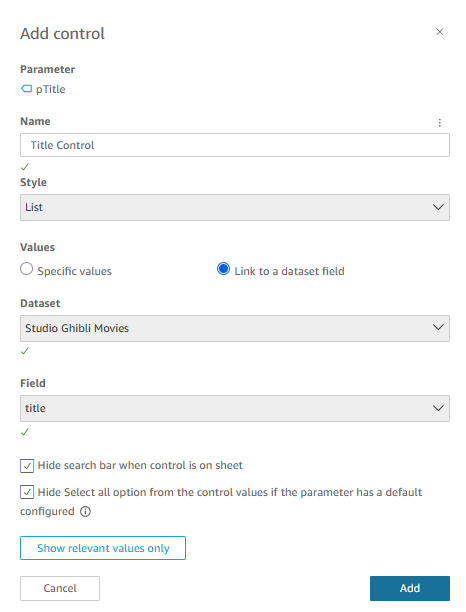
   


   - No topo, em **Controls**, clique nos 3 pontinhos do **Title Control**.
   - Selecione **Move inside this sheet**.
   - Arraste-o para o local desejado. <br> 
    <br>
   
   


   - Visual: **Movie Poster Image (Table)**.
     - Crie um campo calculado chamado **ImageURL**.
     - Utilize o seguinte código:
     ```QuickSight
     ifelse(
        title = ${pTitle}, 
        concat('https://image.tmdb.org/t/p/w500/', poster, '.jpg'), 
        NULL
     )
     ```
     - Em **Visuals**, clique no botão ao lado de **"ADD"**. <br>
     
    
     
     - Selecione o **Table**. <br>
     
     
     
     - Em **GROUP BY**, coloque a dimensão **ImageURL**.
     - Em **Properties**, expanda o campo **Field styling**.
       - Marque a opção **Show URLs as images**.
       - Marque a opção **Fit to cell height**. <br>
       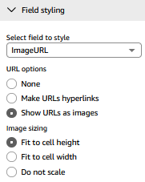
     
     
     - Assim como nos passos anteriores, remova títulos, subtítulos, background, borda e seleção. Tanto da tabela quanto das células. 
     - Redimensione a tabela e a célula para o tamanho desejado e coloque-a no espaço correto. <br>
     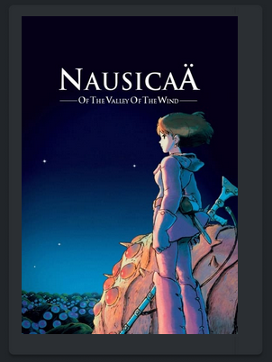
     
     


     - Visual: **Movie Background Image (Table)**.
     - Seguindo os passos do parâmetro **pTitle**, crie um novo parâmetro chamado **pSelectBackdrop**, mas altere o seguinte:
     - Em **Static default value**, digite 1.
     - Crie um novo controler seguinte os passos do **Title Control**, mas altere o seguinte:
     - Em **Control options**, selecione **Specific values**.
     - Em ** Define specific values, digite o seguinte:
     ```text
     1
     2
     3
     ```
     - Marque a opção **Hide searcj bar when control is on sheet**.
     - Marque a opção **Hide Select all option...**.
     - Crie um campo calculado chamado **Backdrop URL**.
     - Utilize o seguinte código:
     ```QuickSight
     ifelse(
        ${pSelectBackdrop}="1", 
        concat('https://image.tmdb.org/t/p/original/', {backdrop_1}, '.jpg'),
        ${pSelectBackdrop}="2",
        concat('https://image.tmdb.org/t/p/original/', {backdrop_2}, '.jpg'),
        ${pSelectBackdrop}="3", 
        concat('https://image.tmdb.org/t/p/original/', {backdrop_3}, '.jpg'),
        NULL
     )
     ```
     - Em **Visuals**, clique no botão ao lado de **"ADD"**. <br>
     
     
      
     - Selecione o **Table**. <br>
     
     
     
     - Em **GROUP BY**, coloque a dimensão **Backdrop URL**.
     - Em **Properties**, expanda o campo **Field styling**.
       - Marque a opção **SHow URLs as images**.
       - Marque a opção **Fit to cell height**. 
       
     
     
     - Assim como nos passos anteriores, remova títulos, subtítulos, background, borda e seleção. Tanto da tabela quanto das células. 
     - Redimensione a tabela e a célula para o tamanho desejado e coloque-a no espaço correto. <br>
     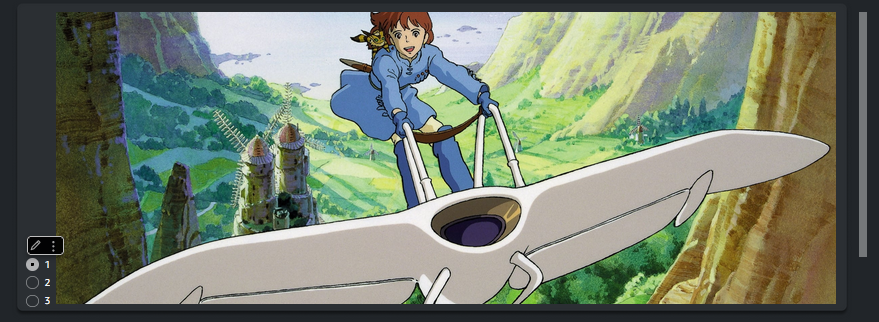
     
     

     - Siga os passos anteriores para adicionar o restante dos visuais. <br>

     - Volte a página **Analysis** e clique na tabela.
     - No canto direito, selecione **Interactions**.
     - Expanda o campo **Actions**.
     - Clique em **ADD ACTION**.
     - Em **Activation, selecione a opção **Select**.
     - Em **Action Type**, selecione **Navigation action**.
     - Em **Target sheet**, selecione **Movie Details**.
     - Em **Parameters**, clique em **" + "**.
     - Em **Select parameter**, selecione **pTitle**.
     - Em **Select value**, selectione **Field: Title**. <br>
    
     - Clique no canto superior direito em **Publish**.
     - Digite um nome para o Dashboard.
     - Clique em **Publish dashboard**.
     - Volte para a página inicial do Quicksight.
     - Clique em **Dashboards** e selecione o seu Dashboard. <br>
       
     ## Resultado Final

     ### Página **Analysis** <br>
      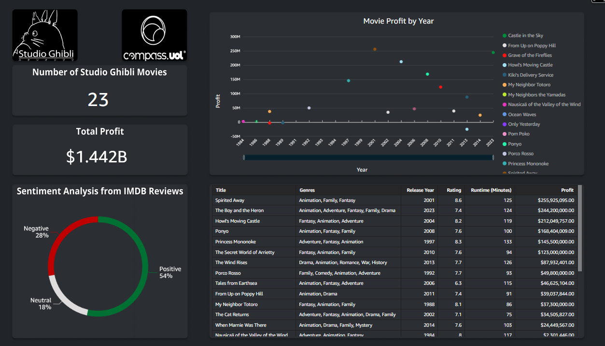

     ### Página **Movie Details** <br>
      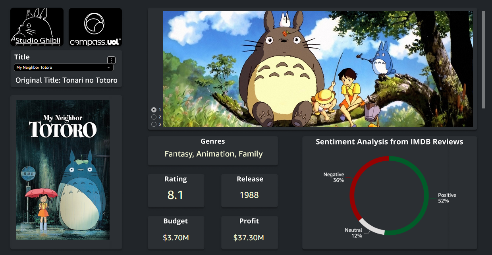

     

    
   

     
     
   
